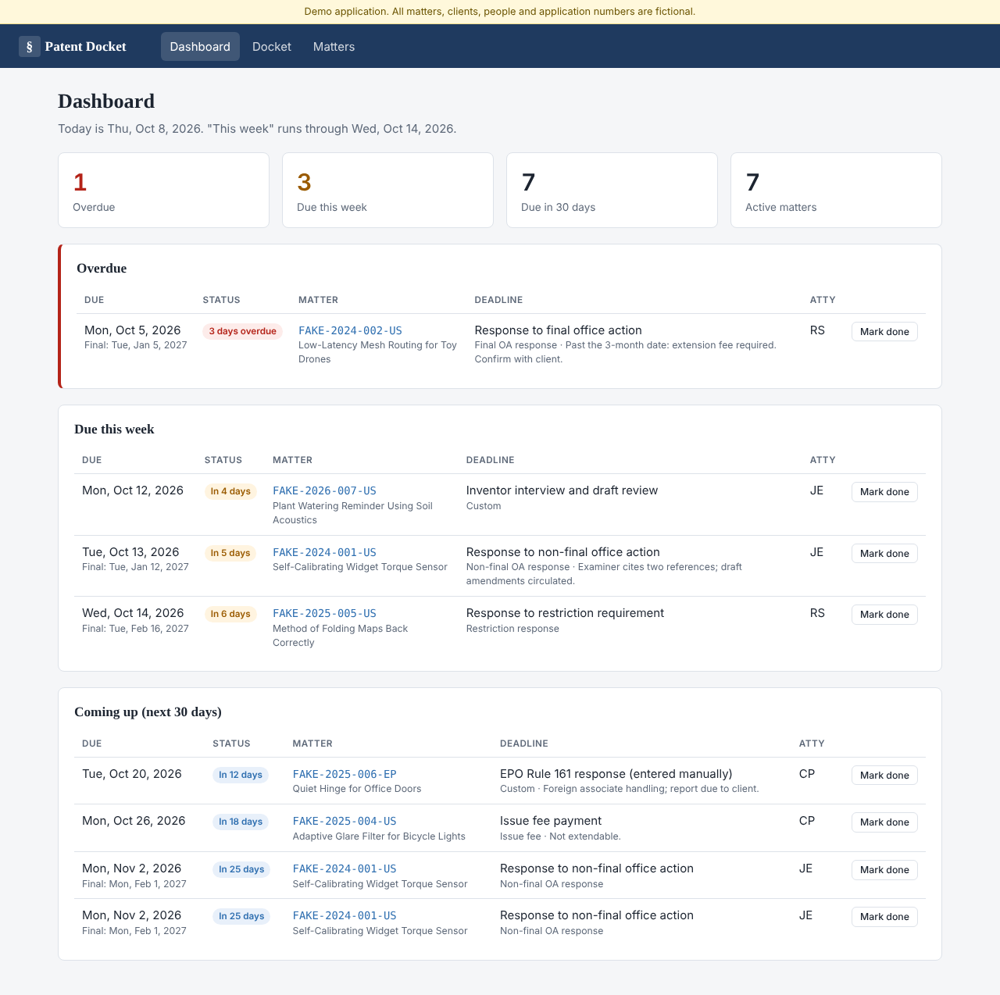
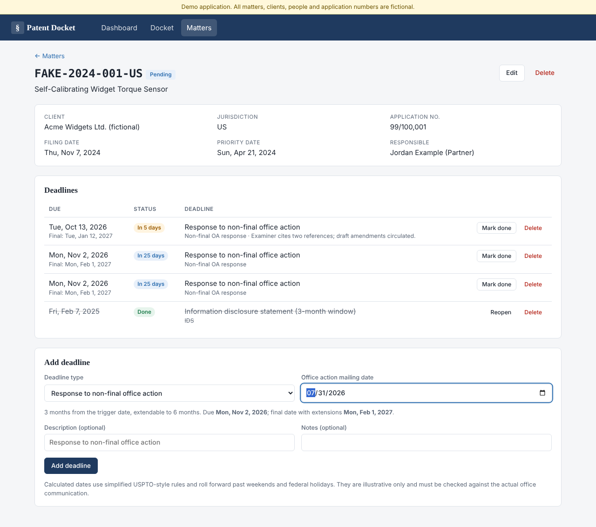
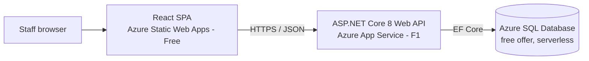

# Patent Docket Manager

[](https://github.com/AhmadRuman/patent-docket-manager/actions/workflows/ci.yml)
[](https://github.com/AhmadRuman/patent-docket-manager/actions/workflows/deploy-azure.yml)

**Live demo:** [happy-sky-07e88370f.1.azurestaticapps.net](https://happy-sky-07e88370f.1.azurestaticapps.net) · **API docs:** [Swagger UI](https://patentdocket-api-g5avt7x64fwcs.azurewebsites.net/swagger)

> Hosted on Azure free tiers: the first request after a quiet period can take 30–60 seconds while the API and database wake up.

An internal docketing tool for a patent practice. Staff log matters, docket response deadlines (with due dates calculated from the triggering office communication) and see at a glance what is overdue, what is due this week and what is coming up.

**Stack:** C# / ASP.NET Core 8 Web API · Entity Framework Core · SQL Server / Azure SQL · React 19 + TypeScript (Vite) · Azure App Service + Static Web Apps · GitHub Actions

> [!IMPORTANT]
> **All data in this project is fictional.** Every client, matter, title, person and application number was invented for this demo. Clients are suffixed "(fictional)", docket numbers start with `FAKE-`, people have `@example.com` addresses, and US application numbers use the `99/` series, which the USPTO does not assign. No real client, inventor or filing information was used at any point in building or testing it.
>
> Docketing data is confidential client information: it can reveal what a client is developing before anything is published. A portfolio project has no business holding real data, so this one is built to make that obvious at a glance. The UI carries a permanent "demo, fictional data" banner and the "new matter" form asks for fictional data only.



## Features

- **Dashboard**: overdue items, deadlines due in the next 7 days and the 30-day outlook, plus summary counts. Deadlines can be marked done in place.
- **Matters**: create, search (docket number, title, client, application number), filter by status, edit and delete matters, and assign a responsible attorney.
- **Rule-based deadlines**: pick the communication type (e.g. non-final office action) and its mailing date, and the API calculates the due date and the final date with extensions. The form previews the result before you save it.
- **Business-day roll-forward**: due dates that land on a weekend or a US federal holiday move to the next business day (35 U.S.C. 21(b)). For example, a 3-month date that falls on Columbus Day 2026 moves to Tuesday 13 October.
- **Docket view**: every deadline filtered by date range, attorney and open/completed status.
- **Custom deadlines** for anything the rules don't cover (foreign deadlines, client reporting dates, internal reviews).
- **"Today" in the firm's time zone** (`Docket:TimeZone`, default `America/New_York`), so a server running in UTC doesn't flip the dashboard to tomorrow at 8 pm.



### Docketing rules

| Type | Due | Final date with extensions |
|---|---|---|
| Non-final office action response | 3 months from mailing | 6 months |
| Final office action response | 3 months from mailing | 6 months |
| Restriction requirement response | 2 months from mailing | 6 months |
| Notice to file missing parts | 2 months from mailing | 7 months |
| Issue fee | 3 months from notice of allowance | not extendable |
| PCT national phase entry | 30 months from earliest priority | not extendable |
| IDS (3-month window) | 3 months from filing / national stage entry | none |

Month periods end on the same day of the month; if that day doesn't exist, the period ends on the last day of the month (30 Nov + 3 months = 28 Feb). These rules are **simplified and illustrative**, not legal advice. A real docketing system needs rules maintained by docketing professionals, plus a second-person check on every computed date.

## Architecture



```
backend/
  src/PatentDocket.Api/
    Controllers/       Matters, Deadlines (+ dashboard, rules), Attorneys
    Domain/            Matter, Deadline, Attorney entities
    Services/          DeadlineRules, UsFederalHolidayCalendar, DocketClock
    Data/              DbContext, EF Core migrations, fictional demo seeder
    Contracts/         Request/response DTOs and mapping
  tests/PatentDocket.Api.Tests/   xUnit: rules, holiday calendar, HTTP integration tests
frontend/
  src/pages/           Dashboard, Docket, Matters, Matter detail, New matter
  src/components/      DeadlineTable, DeadlineForm, MatterForm, ...
infra/                 Bicep template + provisioning script for Azure
.github/workflows/     CI (build, tests, SQL Server migration check) and Azure deploy
```

## Running locally

You need the [.NET 8 SDK](https://dotnet.microsoft.com/download) and Node.js 20+.

### Option A: no database install (SQLite)

```bash
cd backend/src/PatentDocket.Api
dotnet run --launch-profile Sqlite          # API on http://localhost:5080, Swagger at /swagger

cd frontend
npm install
npm run dev                                  # http://localhost:5173 (proxies /api to :5080)
```

SQLite is for quick local runs and the tests only. The production schema is managed by SQL Server migrations.

### Option B: SQL Server in Docker

```bash
docker compose up -d --build                 # SQL Server 2022 + API on :5080, migrated and seeded
cd frontend && npm install && npm run dev
```

Or point `ConnectionStrings:Docket` in `appsettings.json` at any SQL Server (LocalDB, Developer edition) and run `dotnet run --launch-profile SqlServer`. Migrations run on startup. If the database is empty, fictional demo data is seeded with dates relative to today, so the dashboard always has something to show.

### Tests

```bash
cd backend && dotnet test                    # 37 tests: rules, holidays, API integration (in-process, SQLite)
cd frontend && npm test && npm run lint      # Vitest + Testing Library
```

CI also starts a real SQL Server 2022 container. It checks that the migrations match the EF model, boots the API against SQL Server and calls the endpoints.

## Deploying to Azure (free tier)

| Resource | SKU | Cost |
|---|---|---|
| Azure SQL Database | Serverless GP, [free offer](https://learn.microsoft.com/azure/azure-sql/database/free-offer) (`useFreeLimit`, auto-pause when the allowance is used) | Free |
| App Service (API) | Linux F1 | Free |
| Static Web Apps (React) | Free | Free |

1. **Provision the resources** (needs the Azure CLI and `az login`):
   ```bash
   SQL_ADMIN_PASSWORD='<strong password>' ./infra/provision.sh rg-patent-docket-demo eastus2
   ```
   This deploys `infra/main.bicep` and prints the API and web URLs, the App Service name and the Static Web Apps deployment token.

   If it fails with `SubscriptionIsOverQuotaForSku` (F1 VMs limit 0), your subscription has no free App Service quota in that region. Delete the empty resource group and retry with a new group name in another region, e.g. `centralus`. This demo is deployed in Central US.

2. **Let GitHub Actions deploy with OIDC** (no stored Azure passwords):
   ```bash
   az ad app create --display-name patent-docket-deploy        # note the appId
   az ad sp create --id <appId>
   az role assignment create --assignee <appId> --role Contributor \
     --scope /subscriptions/<subId>/resourceGroups/rg-patent-docket-demo
   az ad app federated-credential create --id <appId> --parameters '{
     "name": "github-production", "issuer": "https://token.actions.githubusercontent.com",
     "subject": "repo:<owner>@<ownerId>/<repo>@<repoId>:environment:production",
     "audiences": ["api://AzureADTokenExchange"] }'
   ```
   GitHub's OIDC subject includes the numeric owner and repository IDs, e.g.
   `repo:AhmadRuman@153532748/patent-docket-manager@1410578108:environment:production` for this repo.
   Look yours up with `curl -s https://api.github.com/repos/<owner>/<repo> | jq '.owner.id, .id'`.
   If the login step fails with `AADSTS700213: No matching federated identity record`, the log prints
   the exact subject GitHub sent; create a federated credential with that value.
   In the GitHub repo, create an environment named `production`, then add:
   - secrets `AZURE_CLIENT_ID` (appId), `AZURE_TENANT_ID`, `AZURE_SUBSCRIPTION_ID`, `AZURE_STATIC_WEB_APPS_API_TOKEN`
   - variable `AZURE_WEBAPP_NAME` (printed by the provisioning script)

3. **Push to `main`** (or run *Deploy to Azure* manually). The workflow publishes the API to App Service and builds the React app with `VITE_API_BASE_URL` pointing at it. The deploy jobs are skipped until `AZURE_WEBAPP_NAME` is set, so forks and fresh clones don't fail.

On the free tier, the API cold-starts after idling (F1 has no Always On) and the database auto-pauses. The API's EF Core retry policy covers the database resuming, but expect the first request after a quiet period to be slow.

## API

Swagger UI is at `/swagger`. Main endpoints:

| Method | Route | Purpose |
|---|---|---|
| GET | `/api/dashboard` | Overdue, this week (next 7 days) and 30-day outlook |
| GET | `/api/matters?search=&status=&attorneyId=` | List matters with next due date |
| GET/POST/PUT/DELETE | `/api/matters/{id}` | Matter CRUD (deleting a matter deletes its deadlines) |
| POST | `/api/matters/{id}/deadlines` | Add a deadline: `{type, triggerDate}` to calculate, or `{dueDate, description}` |
| GET | `/api/deadlines?from=&to=&status=Open\|Completed\|All&attorneyId=` | Docket query |
| POST | `/api/deadlines/{id}/complete` · `/reopen` | Mark done / undo |
| GET | `/api/deadline-rules` · `/api/deadline-rules/calculate?type=&triggerDate=` | Rules and preview |
| GET | `/health` | Liveness + database connectivity |

Errors are returned as RFC 9457 problem details (`400` validation, `404`, `409` duplicate docket number).

## Production hardening (deliberately out of scope for the demo)

This is a portfolio demo holding fictional data, so it skips things a real deployment holding client data would need:

- **Authentication and authorisation.** The demo API is open. In production it would sit behind Microsoft Entra ID (App Service authentication or MSAL plus JWT bearer validation), with role-based access (docketing staff vs attorneys) and ethical-wall restrictions per matter.
- **Network isolation.** Private endpoints / VNet integration for Azure SQL instead of "Allow Azure services", and managed identity for the database connection instead of a SQL password.
- **Audit trail.** Who changed or completed which deadline and when (and ideally temporal tables), because docket changes need to be defensible.
- **Docketing rules** maintained as data by docketing professionals, covering more offices (EPO, JPO, ...), with two-person verification of computed dates and reminder emails.
- **Backups and retention** policies aligned with the firm's records-management obligations.
